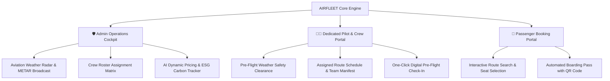

# ✈️ AIRFLEET: AI-Powered Airline Revenue & Operations Management System

> **Major Project for G H Raisoni College of Engineering and Management Jalgaon**  
> *Department of Computer Engineering & Information Technology (Academic Year 2025 – 2026)*

---

## 📌 Executive Summary

**AIRFLEET** is a full-stack, 3-panel enterprise airline operations platform. It integrates **real-time Aviation METAR Weather Intelligence**, **AI Dynamic Ticket Pricing**, **ESG Carbon Emission Tracking**, and **Role-Based Crew Roster Scheduling** into a single unified dashboard architecture.

It eliminates data silos between airline dispatchers, pilots, cabin crew members, and booking passengers.

---

## 🏛️ System Architecture (3-Panel Unified Platform)



---

## 🌟 Key Features & Innovations

### 1. 🌤️ Aviation Weather Radar & METAR Intelligence
- Real-time atmospheric telemetry across 7 major Indian airport hubs: **Jalgaon (JLG), Mumbai (BOM), Delhi (DEL), Pune (PNQ), Hyderabad (HYD), Goa (GOI), Bengaluru (BLR)**.
- Monitors Temperature (°C), Wind Velocity (Knots), Visibility (Meters), and Barometric Pressure.
- Automated METAR broadcast generation with safety clearance status tags:
  - 🟢 `SAFE TO FLY`
  - 🟡 `CAUTION: HIGH WINDS`
  - 🟠 `FLIGHT DELAY: DENSE FOG`
  - 🔴 `REROUTE: SEVERE THUNDERSTORM`

### 2. 👩‍✈️ Dedicated Pilot & Crew Duty Portal
- Individual employee duty profile, ID, and active assignment tracking.
- Destination-specific **Pre-Flight Weather Clearance Badge (`FLIGHT SAFETY CLEARED`)**.
- Team manifest showing Captains, First Officers, and Cabin Crew leads with one-click **Pre-Flight Check-In**.

### 3. 📈 AI Dynamic Ticket Pricing Engine
- Monitors real-time booking velocity and remaining seat inventory.
- Automatically adjusts multi-tier fares across Economy, Business, and First Class:
  $$\text{Fare} = \text{Base} + (\text{Distance} \times \text{Rate}) \times \text{Demand\_Multiplier}$$

### 4. 🌿 ESG Carbon Emission Tracker
- Calculates flight-level fuel burn (Liters) based on aircraft specifications (e.g. ATR 72-600 @ 19.2L/km).
- Computes $CO_2$ carbon footprint per passenger-kilometer for ICAO CORSIA environmental reporting compliance.

---

## 🛠️ Technology Stack

| Layer | Technology Used |
| :--- | :--- |
| **Frontend UI** | React.js 18 (Vite), Lucide-React Icons, Glassmorphism CSS3 |
| **Backend REST API** | Node.js, Express.js (Port 5000) |
| **Database Engine** | SQLite3 Relational Database (`airport_weather`, `crew_members`, `crew_assignments`, `flights`) |
| **State Resilience** | Offline LocalStorage Fallback Engine (`mockStore.js`) |

---

## 🚀 Quick Setup & Installation Guide

### Prerequisites
- [Node.js](https://nodejs.org/) (v16.x or higher)
- npm or yarn

### 1. Clone the Repository
```bash
git clone https://github.com/your-username/Airline-Management-System.git
cd Airline-Management-System
```

### 2. Install Dependencies
```bash
npm install
```

### 3. Start Backend API Server
```bash
node server/server.js
```
*Backend API server runs at:* `http://localhost:5000`

### 4. Start Frontend React Development Server
```bash
npm run dev
```
*Frontend web app runs at:* `http://localhost:5173`

---

## 🔑 Default Login Credentials (For Testing & Demo)

| Portal Role | Email | Password |
| :--- | :--- | :--- |
| 🛡️ **Admin Cockpit** | `admin@jalgaon.aero` | `Admin@12345` |
| 👩‍✈️ **Pilot / Crew Portal** | `priya.deshmukh@jalgaon.aero` | `Crew@12345` |
| 👤 **User / Passenger** | `user@jalgaon.aero` | `User@12345` |

---

## 🎓 Academic Attribution & Credits
- **College:** G H Raisoni College of Engineering and Management Jalgaon
- **Department:** Computer Engineering & Information Technology
- **Academic Session:** 2025 – 2026
- **Project Domain:** Artificial Intelligence, Software Engineering & Aviation Operations
